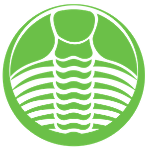

***

# Description:

This repository contains of my own <b><a href="filter.txt">security filter</a></b> for <b><a href="https://adguard.com/en/adguard-home.html">AdGuard Home</a></b> that blocks:
- Advertising, CPA and banner networks domains and their subdomains☂️
- Tracking and telemetry hosts and their subdomains📡
- CNAME cloacking, analytics and metrics domains and their subdomains🕵️‍♂️
- Chat, cookies and push services hosts and their subdomains🔕
- Adware, spyware, malware and ransomware domains and their subdomains🤬
- Phishing, fraud, fake and scam hosts and their subdomains💩
- Mining, cryptojacking and malicious domains and their subdomains⛏

Also, this list blocks much spam, adult, gambling and illegal pharmacy selling hosts🔞You can use it any way you want, but I recommend using it with the desktop versions of <b><a href="https://adguard.com/en/adguard-mac/overview.html">AdGuard</a></b>🛡The file will be updated regularly⚠️

## Note:

My filter is optimized for use <b>ONLY</b> in <b><a href="https://github.com/AdguardTeam/AdGuardHome">AdGuard Home</a></b>🛸Please do not convert it to hosts, dnsmasq, BIND, Squid or RPZ syntaxes⛔️Feel free to <b><a href="mailto:contact@ammnt.app">contact me</a></b> with false positive blocks and more domains which need to be blocked🙋🏻‍♂️
